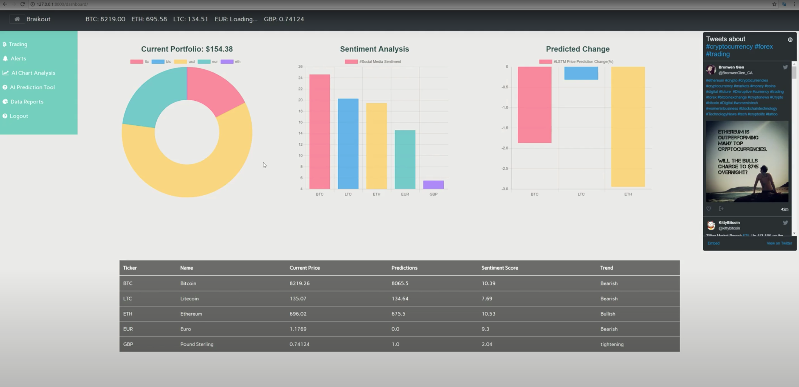
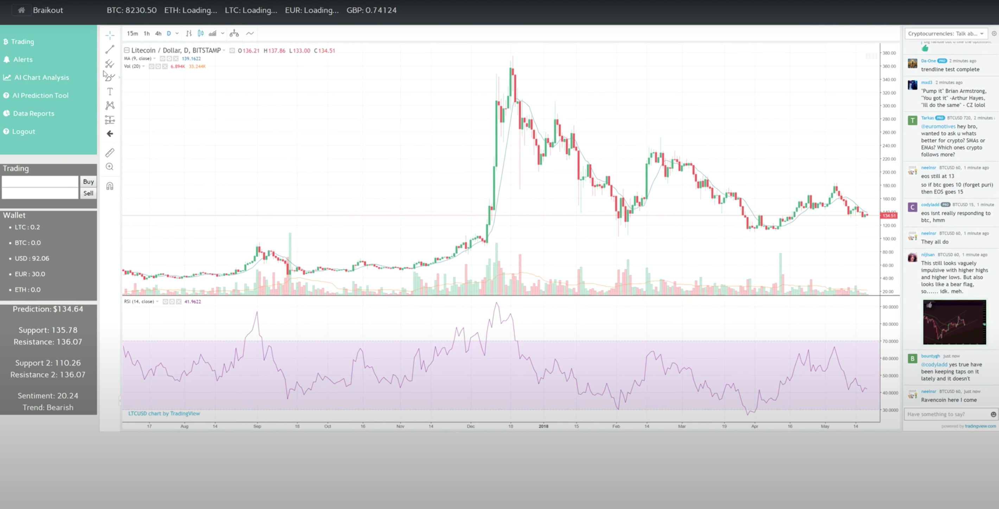
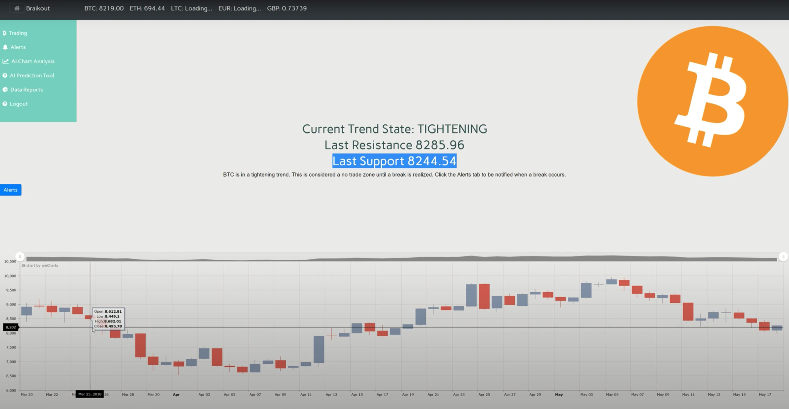
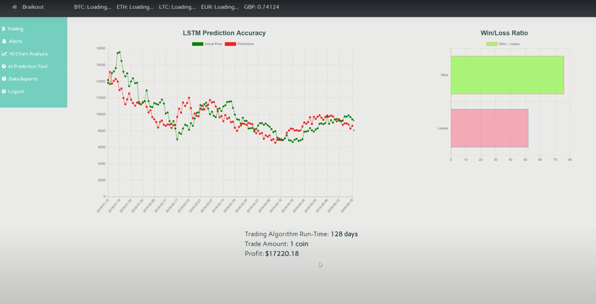
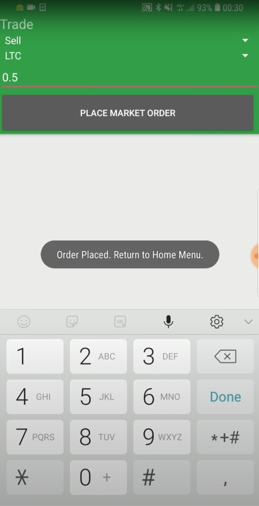

# Braikout

Braikout is a cryptocurrency and forex trading platform which makes use of machine learning and automated candlestick chart analysis, designed with the intent of making the job of traders easier, less time consuming, and more profitable. 

## Video Demonstration

https://www.youtube.com/watch?v=9OECMEj2i70&feature=youtu.be

## Functionality:
 -	Cryptocurrency and Forex Trading
 - Machine Learning Price Prediction 
 - 	Real-Time Sentiment Analysis
 -	Automatic Chart Analysis
 -	User Alert System
 -	Data Visualisation of markets, performance, and evaluation of the project
 -	Android Notifications and Trading

## Screenshots

